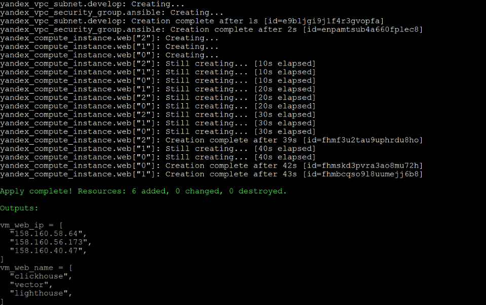
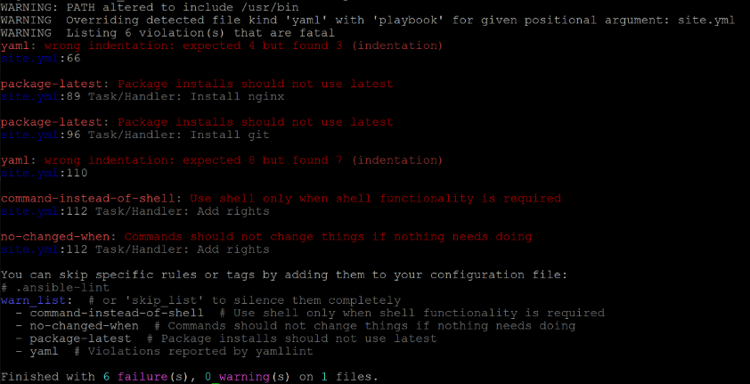
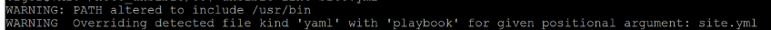
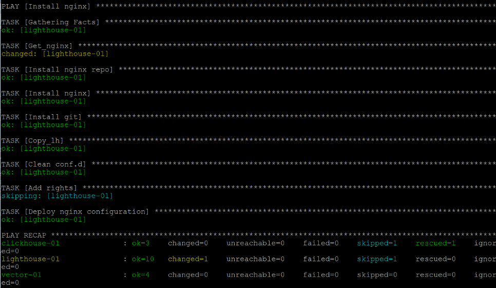
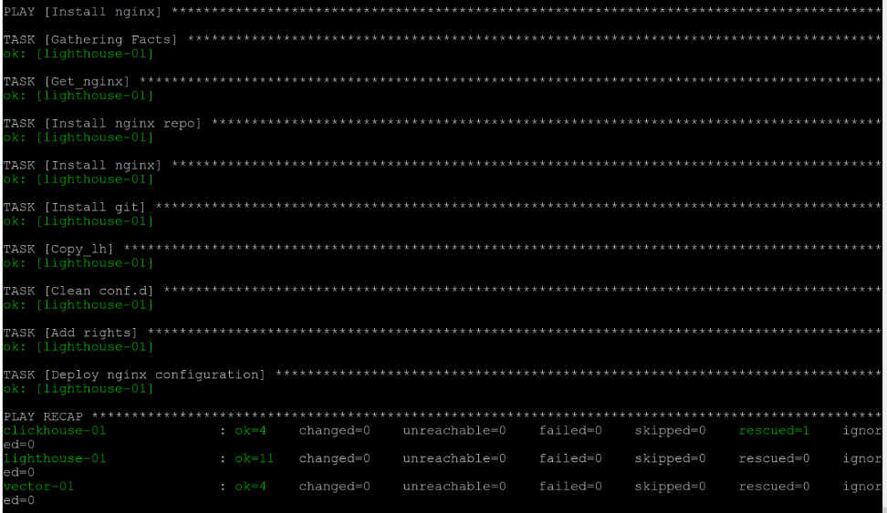
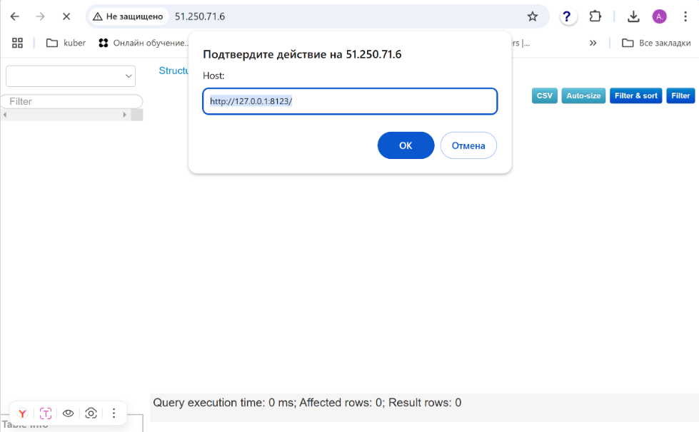

# Ansible Playbook для домашнего задания «Использование Ansible»

# Обзор

## 1 Установка ClickHouse
Этот плейбук выполняет установку ClickHouse на целевых хостах. 
Он загружает необходимые RPM-пакеты, устанавливает их через YUM, 
запускает сервис ClickHouse и создает базу данных logs.

### Хэндлеры:
Start clickhouse service: Перезапуск сервиса ClickHouse после завершения установки пакетов.
### Задачи:
Get clickhouse distrib:

Загружает RPM-пакеты ClickHouse с официального сайта.

Install clickhouse packages:

Устанавливает загруженные RPM-пакеты через YUM.

## Flush handlers:

Принудительно вызывает все накопленные хендлеры.

### Create database:
Создает базу данных logs с помощью команды clickhouse-client.

## 2 Установка Vector
Этот плейбук устанавливает агент сбора логов Vector на целевом хосте. 

Он загружает RPM-пакет Vector, устанавливает его через YUM, копирует конфигурацию и запускает сервис Vector.

### Хэндлеры:

Start vector service: Запуск сервиса Vector после развертывания конфигурации.

### Задачи:

Get_vector:

Загружает RPM-пакет Vector с официального сайта.

Install vector:

Устанавливает загруженный RPM-пакет через YUM.

Deploy Vector configuration:

Копирует шаблон конфигурации vector.yml в соответствующую директорию.

## Создание директории для Lighthouse
### Описание:

Этот плейбук создает директорию /var/www/html на целевом хосте и задает ей правильные права доступа.

### Задачи:
Create_lh_dir:

Создает директорию /var/www/html и задает права доступа владельцу nginx.

## Установка Nginx и настройка Lighthouse
### Описание:

Этот плейбук устанавливает веб-сервер Nginx на целевом хосте,
клонирует репозиторий Lighthouse из GitHub,
настраивает конфигурацию Nginx и перезапускает сервис.

### Хэндлеры:
start-nginx: Перезапуск сервиса Nginx после изменения конфигурации.

### Задачи:
Get_nginx:

Загружает RPM-пакет репозитория Nginx с официального сайта.

Install nginx repo:

Устанавливает репозиторий Nginx через YUM.

Install nginx:

Устанавливает сам Nginx через YUM.

Install git:

Устанавливает утилиту git для последующего клонирования репозитория.

Copy_lh:

Клонирует репозиторий Lighthouse из GitHub.

Clean conf.d:

Удаляет стандартный конфиг Nginx default.conf.

Add rights:

Выполняет команду setenforce Permissive для снятия ограничений SELinux.

Deploy nginx configuration:

Разворачивает пользовательскую конфигурацию Nginx из шаблона lh.conf.

## Использование

ansible-playbook site.yml -i inventory/prod.yml

# Домашнее задание к занятию «Использование Ansible»

## Подготовка
* Разворачиваем три хоста для Clickhouse, Vector и Lighthouse на Yandex Cloud с помощью терраформ, делаем необходимые outputs,
  чтобы узнать внешние IP адреса хостов:

* Применяем

## Задание 1

* Добавляем IP адреса в inventory

[inventory](inventory/prod.yml)

## Задание 2-4

* Добавляем установку Lighthouse (установить nginx, скопировать файлы lighthouse, дать права)

[site.yml](site.yml)

## Задание 5

* Проверяем линтером

* Исправляем ошибки

[site.yml](site.yml)

## Задание 6

ansible-playbook site.yml -i inventory/prod.yml --check

## Задание 7

ansible-playbook site.yml -i inventory/prod.yml --dif

## Задание 8 

повторно

ansible-playbook site.yml -i inventory/prod.yml --dif

* проверяем работу lighthouse

