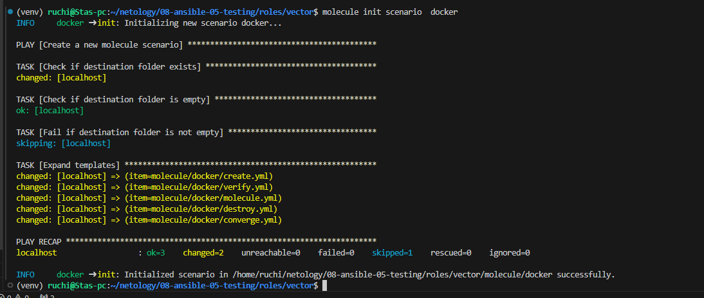
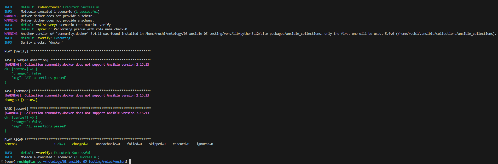
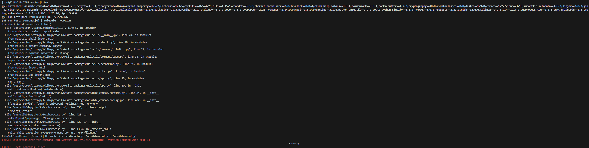
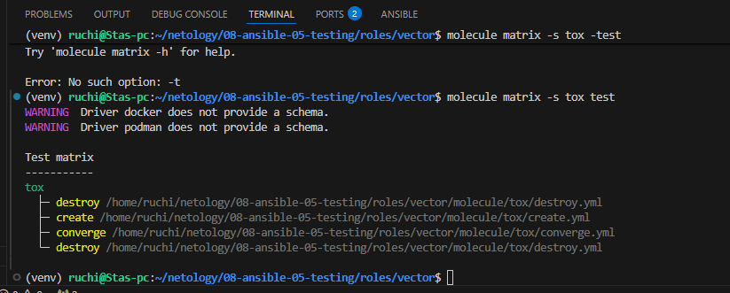

# Домашнее задание к занятию «Тестирование roles»

## Подготовка

* Устанавливаю molecule и его драйвера

 pip3 install molecule molecule_docker molecule_podman

* Возвращаю прежнюю версию ansible-core

 pip3 install ansible-core

* docker pull aragast/netology:latest
```
latest: Pulling from aragast/netology
f70d60810c69: Pull complete
545277d80005: Pull complete
3787740a304b: Pull complete
8099be4bd6d4: Pull complete
78316366859b: Pull complete
a887350ff6d8: Pull complete
8ab90b51dc15: Pull complete
14617a4d32c2: Pull complete
b868affa868e: Pull complete
1e0b58337306: Pull complete
9167ab0cbb7e: Pull complete
907e71e165dd: Pull complete
6025d523ea47: Pull complete
6084c8fa3ce3: Pull complete
cffe842942c7: Pull complete
d984a1f47d62: Pull complete
Digest: sha256:e44f93d3d9880123ac8170d01bd38ea1cd6c5174832b1782ce8f97f13e695ad5
Status: Downloaded newer image for aragast/netology:latest
docker.io/aragast/netology:latest
```

## Molecule

* Запускам Тестирование, видим ошибку
```
(venv) ruchi@Stas-pc:~/netology/08-ansible-05-testing/roles/clickhouse$ molecule test -s ubuntu_xenial
WARNING  Driver docker does not provide a schema.
ERROR    Failed to validate /home/ruchi/netology/08-ansible-05-testing/roles/clickhouse/molecule/ubuntu_xenial/molecule.yml


(venv) ruchi@Stas-pc:~/netology/08-ansible-05-testing/roles/clickhouse$ molecule test -s centos_7
WARNING  Driver docker does not provide a schema.
ERROR    Failed to validate /home/ruchi/netology/08-ansible-05-testing/roles/clickhouse/molecule/centos_7/molecule.yml
```

* В каталоге roles/vector создаем сценарий тестирования



* Запускаем

 molecule test




## Задание Tox

```
docker run --privileged=True -v /home/ruchi/netology/08-ansible-05-testing/roles/vector:/opt/vector -w /opt/vector -it aragast/netology:latest /bin/bash
```





